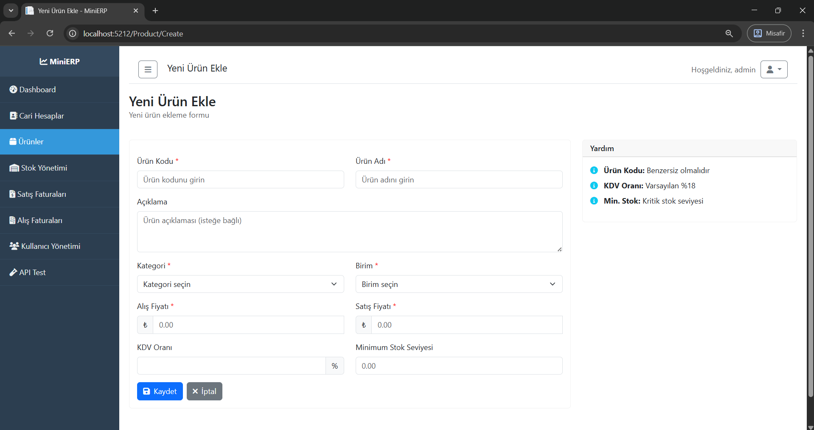

# MiniERP - Küçük İşletmeler İçin ERP Sistemi

Bu proje, küçük ve orta ölçekli işletmeler için geliştirilmiş kapsamlı bir ERP (Enterprise Resource Planning) sistemidir. Ana amacımız, .NET teknolojileri kullanarak hem masaüstü hem de web tabanlı uygulamalar geliştirmek ve bu uygulamaların birbiriyle tam senkronizasyon halinde çalışmasını sağlamaktır. 

**Proje Hedefi:** Küçük işletmelerin günlük operasyonlarını (stok, satış, alış, cari hesap) kolayca yönetebilmesi için pratik ve kullanışlı bir sistem sunmak. Sistem 4 ana aşamadan oluşur ve her aşama kendine özgü teknolojiler kullanır.

## Proje Genel Görünümü


MiniERP sistemi, küçük işletmelerin ihtiyaçlarını karşılamak üzere tasarlanmış aşağıdaki ana modülleri içerir:
- **Cari Hesap Yönetimi** (Müşteri/Tedarikçi takibi ve bakiye kontrolü)
- **Stok Yönetimi** (Ürün ve stok takibi, otomatik stok güncelleme)
- **Satış Yönetimi** (Satış faturaları ve otomatik senkronizasyon)
- **Alış Yönetimi** (Alış faturaları ve otomatik senkronizasyon)
- **Raporlama** (İş süreçlerini takip eden çeşitli raporlar)

**Senkronizasyon Özelliği:** Tüm işlemler (fatura onaylama, stok güncelleme, cari bakiye hesaplama) otomatik olarak gerçekleşir ve masaüstü ile web uygulaması arasında tam senkronizasyon sağlanır.

## Projenin 4 Aşaması

### 1. AŞAMA: SQL VERİTABANI

İlk aşamada SQL Server veritabanı oluşturulmuştur. Bu aşama projenin temelini oluşturur.


#### Veritabanı Yapısı:
- **19 ana tablo** (Users, Products, CariAccounts, SalesInvoices vs.)
- **Otomatik trigger'lar** (Stok ve cari güncellemeleri için)
- **Varsayılan veriler** (Roller, birimler, ödeme türleri)
- **İndeksler** (Performans için)

#### Önemli Tablolar:
```sql
-- Örnek: CariAccounts tablosu
CREATE TABLE CariAccounts (
    Id INT PRIMARY KEY IDENTITY(1,1),
    Code NVARCHAR(50) NOT NULL,
    Name NVARCHAR(200) NOT NULL,
    Balance DECIMAL(18,2) DEFAULT 0,
    CreditLimit DECIMAL(18,2) DEFAULT 0,
    CariTypeId INT FOREIGN KEY REFERENCES CariTypes(Id)
);
```

#### Otomatik İşlemler:
Veritabanında önemli trigger'lar vardır. Örneğin satış faturası onaylandığında:
1. Stok otomatik azalır
2. Cari hesapta alacak kaydı oluşur
3. Stok hareket kaydı oluşur

#### Kurulum:
```sql
-- 1. Database klasöründeki dosyaları sırayla çalıştır:
-- MiniERP_Clean.sql (Ana veritabanı)
-- Test_Data_Insert.sql (Örnek veriler)
```

### 2. AŞAMA: API (Web API)

İkinci aşamada RESTful Web API geliştirilmiştir. Bu API, veritabanı ile diğer aşamalar arasında köprü görevi görür.


#### Teknoloji Yığını:
- **.NET 8.0** (Modern framework)
- **Entity Framework Core** (ORM)
- **JWT Authentication** (Güvenlik)
- **AutoMapper** (Nesne dönüştürme)
- **Serilog** (Loglama)
- **Swagger/OpenAPI** (API dokümantasyon)

#### Ana Controller'lar:
```csharp
// Örnek: CariAccountsController
[ApiController]
[Route("api/[controller]")]
[Authorize]
public class CariAccountsController : ControllerBase
{
    private readonly ICariAccountService _cariAccountService;
    
    [HttpGet]
    public async Task<IActionResult> GetAll()
    {
        var accounts = await _cariAccountService.GetAllAsync();
        return Ok(accounts);
    }
    
    [HttpPost]
    public async Task<IActionResult> Create(CariAccountDto dto)
    {
        var result = await _cariAccountService.CreateAsync(dto);
        return CreatedAtAction(nameof(GetById), new { id = result.Id }, result);
    }
}
```

#### Yapılan İşlemler:
- **Repository Pattern** (Veri erişimi)
- **Service Layer** (İş mantığı)
- **DTO'lar** (Veri transfer nesneleri)
- **JWT ile güvenlik**
- **CORS desteği**

#### API Çalıştırma:
```bash
cd MiniERP.API
dotnet run
# API şu adreste çalışır: http://localhost:5000
```

### 3. AŞAMA: WINDOWS FORMS UYGULAMASI

Üçüncü aşamada masaüstü uygulaması geliştirilmiştir. Bu uygulama API'yi kullanarak çalışır.


#### Özellikler:
- **15+ farklı form** (Cari, Stok, Satış, Alış vs.)
- **API entegrasyonu** (HttpClient ile)
- **Kullanıcı dostu arayüz**
- **Grid'lerle veri listeleme**
- **Detaylı formlar**

#### Ana Formlar:
```csharp
// Örnek: MainForm - Ana menü
public partial class MainForm : Form
{
    private readonly ApiService _apiService;
    private readonly UserDto _loggedInUser;
    
    public MainForm(ApiService apiService, UserDto loggedInUser)
    {
        InitializeComponent();
        _apiService = apiService;
        _loggedInUser = loggedInUser;
    }
    
    private void btnCariAccounts_Click(object sender, EventArgs e)
    {
        var form = new CariAccountListForm(_apiService);
        form.Show();
    }
}
```

#### Yapılan İşlemler:
- **Login sistemi** (JWT ile)
- **CRUD operasyonları** (Ekleme, silme, güncelleme)
- **Listeleme ve filtreleme**
- **Raporlama**
- **Hata yönetimi**


#### Çalıştırma:
```bash
cd MiniERP.WinForms
dotnet run
# Kullanıcı: admin / Şifre: 123456
```

### 4. AŞAMA: WEB UYGULAMASI

Dördüncü aşamada web uygulaması geliştirilmiştir. Bu uygulama da API'yi kullanarak çalışır.


#### Teknoloji Yığını:
- **.NET 9.0 MVC** (Web framework)
- **Bootstrap** (UI framework)
- **jQuery** (JavaScript)
- **Cookie Authentication** (Oturum yönetimi)
- **HttpClient** (API iletişimi)

#### Ana Controller'lar:
```csharp
// Örnek: CariAccountController
public class CariAccountController : Controller
{
    private readonly CariAccountService _cariAccountService;
    
    public CariAccountController(CariAccountService cariAccountService)
    {
        _cariAccountService = cariAccountService;
    }
    
    public async Task<IActionResult> Index()
    {
        var accounts = await _cariAccountService.GetAllAsync();
        return View(accounts);
    }
    
    [HttpGet]
    public IActionResult Create()
    {
        return View();
    }
    
    [HttpPost]
    public async Task<IActionResult> Create(CariAccountCreateModel model)
    {
        if (ModelState.IsValid)
        {
            await _cariAccountService.CreateAsync(model);
            return RedirectToAction(nameof(Index));
        }
        return View(model);
    }
}
```

#### Yapılan Sayfalar:
- **Dashboard** (Ana sayfa)
- **Cari Hesap Yönetimi**
- **Stok Yönetimi**
- **Satış Faturaları**
- **Alış Faturaları**
- **Raporlar**


#### Çalıştırma:
```bash
cd MiniERP.Web
dotnet run
# Web sitesi: http://localhost:5001
# Kullanıcı: admin / Şifre: 123456
```

## Genel Sistem Mimarisi


Sistem şu şekilde çalışır:
1. **Veritabanı** (SQL Server) - Verilerin saklandığı yer
2. **API** (Web API) - Veritabanı ile iletişim kurar
3. **WinForms** - API'yi kullanarak masaüstü arayüzü sağlar
4. **Web** - API'yi kullanarak web arayüzü sağlar

## Kurulum ve Çalıştırma

### Gereksinimler:
- **.NET 8.0 SDK** (API için)
- **.NET 9.0 SDK** (Web ve WinForms için)
- **SQL Server** (LocalDB veya Full)
- **Visual Studio** (İsteğe bağlı)

### Adım Adım Kurulum:

#### 1. Proje İndirme:
```bash
git clone [repository-url]
cd MiniERP
```

#### 2. Veritabanı Kurulum:
```sql
-- SQL Server Management Studio'da:
-- Database/MiniERP_Clean.sql dosyasını çalıştır
-- Database/Test_Data_Insert.sql dosyasını çalıştır
-- Database/Fix_User_Role.sql dosyasını çalıştır
```

#### 3. API Ayarları:
```json
// MiniERP.API/appsettings.json
{
  "ConnectionStrings": {
    "DefaultConnection": "Server=.;Database=MiniERP_Database;Trusted_Connection=true;TrustServerCertificate=true;"
  },
  "JwtSettings": {
    "Secret": "Bu_Gizli_Anahtar_En_Az_32_Karakter_Olmali_Yoksa_Hata_Verir",
    "Issuer": "MiniERP.API",
    "Audience": "MiniERP.Client"
  }
}
```

#### 4. Çalıştırma Sırası:
```bash
# 1. API'yi çalıştır
cd MiniERP.API
dotnet run

# 2. Yeni terminalde WinForms'u çalıştır
cd MiniERP.WinForms
dotnet run

# 3. Yeni terminalde Web'i çalıştır
cd MiniERP.Web
dotnet run
```

## Kullanım Kılavuzu

### Varsayılan Kullanıcı:
- **Kullanıcı Adı:** admin
- **Şifre:** 123456
- **Rol:** Administrator

### Temel İşlemler:

#### 1. Cari Hesap Ekleme:


1. Cari Hesaplar menüsüne gir
2. "Yeni Ekle" butonuna tıkla
3. Bilgileri doldur (Kod, Ad, Tip)
4. Kaydet

#### 2. Ürün Ekleme:


1. Ürünler menüsüne gir
2. "Yeni Ekle" butonuna tıkla
3. Bilgileri doldur (Kod, Ad, Fiyat)
4. Kaydet

#### 3. Satış Faturası Oluşturma:


1. Satış Faturaları menüsüne gir
2. "Yeni Fatura" butonuna tıkla
3. Müşteri seç
4. Ürünleri ekle
5. Faturayı onayla

## Önemli Özellikler

### 1. Otomatik İşlemler:
- **Stok Güncelleme:** Fatura onaylandığında stok otomatik güncellenir
- **Cari Güncelleme:** Fatura onaylandığında cari bakiye güncellenir
- **Hareket Kayıtları:** Tüm işlemler otomatik kayıt altına alınır

### 2. Güvenlik:
- **JWT Authentication:** API güvenliği
- **Role-based Access:** Rol tabanlı erişim kontrolü
- **HTTPS:** Güvenli iletişim

### 3. Performans:
- **Entity Framework Core:** Hızlı veri erişimi
- **Indexing:** Veritabanı performansı
- **Caching:** Bellek içi önbellekleme

### 4. Raporlama:


- **Cari Bakiye Raporu**
- **Stok Durumu Raporu**
- **Satış Raporu**
- **Alış Raporu**

## Teknik Detaylar

### Veritabanı Şeması:
```sql
-- Ana tablolar arası ilişki
CariAccounts (1) --> (N) CariTransactions
Products (1) --> (N) StockCards
SalesInvoices (1) --> (N) SalesInvoiceDetails
PurchaseInvoices (1) --> (N) PurchaseInvoiceDetails
```

### API Endpoints:
```
GET    /api/cariaccounts          - Tüm cari hesapları getir
POST   /api/cariaccounts          - Yeni cari hesap oluştur
GET    /api/cariaccounts/{id}     - Belirli cari hesap getir
PUT    /api/cariaccounts/{id}     - Cari hesap güncelle
DELETE /api/cariaccounts/{id}     - Cari hesap sil

GET    /api/products              - Tüm ürünleri getir
POST   /api/products              - Yeni ürün oluştur
GET    /api/products/{id}         - Belirli ürün getir
PUT    /api/products/{id}         - Ürün güncelle
DELETE /api/products/{id}         - Ürün sil
```

### Proje Yapısı:
```
MiniERP/
├── Database/                    # SQL dosyaları
│   ├── MiniERP_Clean.sql
│   ├── Test_Data_Insert.sql
│   └── Fix_User_Role.sql
├── MiniERP.API/                # Web API
│   ├── Controllers/            # API Controllers
│   ├── Services/               # İş mantığı
│   ├── Repositories/           # Veri erişimi
│   ├── Models/                 # Entity sınıfları
│   └── DTOs/                   # Data Transfer Objects
├── MiniERP.WinForms/          # Windows Forms App
│   ├── Forms/                  # Form sınıfları
│   ├── Services/               # API iletişimi
│   └── Models/                 # Model sınıfları
└── MiniERP.Web/               # Web Application
    ├── Controllers/            # MVC Controllers
    ├── Views/                  # Razor Views
    ├── Services/               # API iletişimi
    └── Models/                 # View Models
```

## Sorun Giderme

### Yaygın Sorunlar:

#### 1. API Bağlantı Hatası:
```
Hata: "API'ye bağlanılamıyor"
Çözüm: 
- API'nin çalıştığından emin ol (http://localhost:5000)
- Firewall ayarlarını kontrol et
- appsettings.json'daki bağlantı stringini kontrol et
```

#### 2. Veritabanı Bağlantı Hatası:
```
Hata: "SQL Server'a bağlanılamıyor"
Çözüm:
- SQL Server'ın çalıştığından emin ol
- Connection string'i kontrol et
- Database'in oluşturulduğundan emin ol
```

#### 3. JWT Token Hatası:
```
Hata: "401 Unauthorized"
Çözüm:
- Tekrar giriş yap
- JWT secret key'ini kontrol et
- Token süresini kontrol et
```

### Debug Modunda Çalıştırma:
```bash
# API'yi debug modunda çalıştır
cd MiniERP.API
dotnet run --environment Development

# WinForms'u debug modunda çalıştır
cd MiniERP.WinForms
dotnet run --configuration Debug
```

## Geliştirici Notları

### Yeni Özellik Ekleme:
1. **Model oluştur** (Database/Models)
2. **Repository oluştur** (API/Repositories)
3. **Service oluştur** (API/Services)
4. **Controller oluştur** (API/Controllers)
5. **Form/View oluştur** (WinForms/Web)

### Kod Örnekleri:
```csharp
// Yeni bir entity için repository örneği
public class ExampleRepository : GenericRepository<Example>, IExampleRepository
{
    public ExampleRepository(AppDbContext context) : base(context) { }
    
    public async Task<List<Example>> GetActiveExamplesAsync()
    {
        return await _context.Examples
            .Where(x => x.IsActive)
            .ToListAsync();
    }
}
```

Bu proje eğitim amaçlı geliştirilmiştir. 

---

Bu README dosyası projenin tüm aşamalarını ve özelliklerini detaylı bir şekilde açıklamaktadır. Herhangi bir sorunuz olursa lütfen iletişime geçmekten çekinmeyin.

## Fotoğraf Listesi

README'de kullanılacak fotoğraflar (images/ klasörüne koyulacak):

1. **proje-genel-gorunum.png** - Projenin genel mimarisi
2. **database-diagram.png** - Veritabanı şeması
3. **api-swagger.png** - Swagger API dokümantasyonu
4. **winforms-main.png** - WinForms ana ekranı
5. **winforms-cari-list.png** - WinForms cari hesap listesi
6. **web-dashboard.png** - Web uygulaması dashboard
7. **web-cari-create.png** - Web'de cari hesap oluşturma
8. **system-architecture.png** - Sistem mimarisi diyagramı
9. **cari-hesap-ekleme.png** - Cari hesap ekleme ekranı
10. **urun-ekleme.png** - Ürün ekleme ekranı
11. **satis-faturasi.png** - Satış faturası oluşturma
12. **raporlar.png** - Raporlar ekranı 
# Mini ERP

