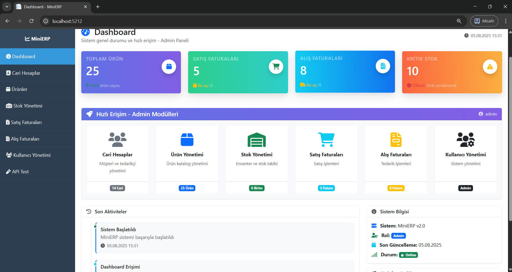
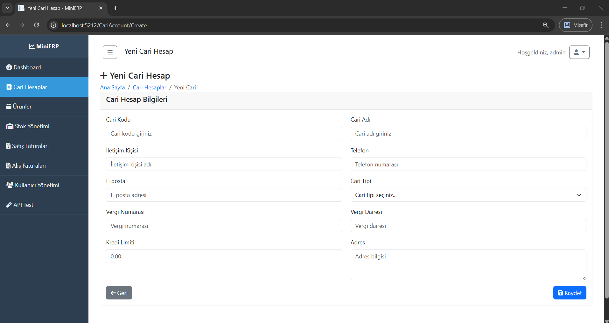
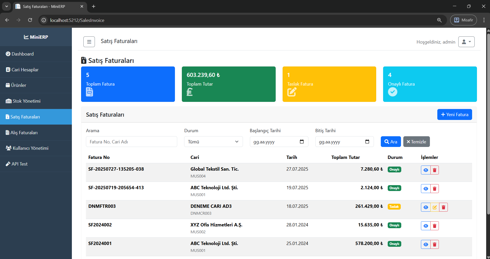

# MiniERP Backend Sistemi

Çok istemci desteği sunan, kurumsal düzeyde mimari, JWT kimlik doğrulama ve modern geliştirme pratikleri içeren kapsamlı bir .NET 8 Web API projesi.

## Mimari Genel Bakış

Bu proje, üç istemci uygulaması ile katmanlı backend mimarisi uygular:

- **MiniERP.API** - RESTful Web API (.NET 8)
- **MiniERP.Web** - Web uygulama istemcisi (ASP.NET Core MVC)
- **MiniERP.WinForms** - Masaüstü uygulama istemcisi (Windows Forms)


## Temel Teknolojiler

### Backend Teknoloji Yığını
- **.NET 8** - En son LTS framework
- **Entity Framework Core** - SQL Server ile code-first ORM
- **JWT Bearer Authentication** - Durumsuz kimlik doğrulama
- **AutoMapper** - Nesne-nesne eşleme
- **Serilog** - Yapılandırılmış loglama
- **Swagger/OpenAPI** - API dokümantasyonu

### Veritabanı
- **SQL Server 2022** - Ana veritabanı
- **Entity Framework Migrations** - Şema yönetimi
- **Code-First yaklaşımı** - Model odaklı geliştirme

### Altyapı
- **Docker & Docker Compose** - Konteynerleştirme
- **CORS** - Çapraz kaynak paylaşımı
- **Middleware pipeline** - İstek/yanıt işleme

## API Özellikleri

### Kimlik Doğrulama ve Yetkilendirme
- JWT token tabanlı kimlik doğrulama
- Rol tabanlı erişim kontrolü (RBAC)
- Güvenli şifre hash'leme
- Token yenileme mekanizması

### Temel Modüller
- **Hesap Yönetimi** - Müşteri/tedarikçi kayıtları
- **Ürün Kataloğu** - Ürün ve kategori yönetimi
- **Envanter Yönetimi** - Stok takibi ve hareketleri
- **Fatura İşleme** - Satış ve alış faturaları
- **Kullanıcı Yönetimi** - Kullanıcı rolleri ve izinleri

### Veri Transfer Nesneleri (DTOs)
```csharp
// Örnek: Ürün DTO
public class ProductDto
{
    public int Id { get; set; }
    public string Code { get; set; }
    public string Name { get; set; }
    public decimal Price { get; set; }
    public int CategoryId { get; set; }
}
```

## Hızlı Başlangıç

### Gereksinimler
- .NET 8 SDK
- SQL Server 2019+ veya SQL Server LocalDB
- Docker Desktop (opsiyonel)

### Kurulum

1. **Depoyu klonlayın**
   ```bash
   git clone https://github.com/kursaddcinar/MiniERP2.git
   cd MiniERP2
   ```

2. **Veritabanı kurulumu**
   ```bash
   # Seçenek 1: Docker Compose kullanın (önerilen)
   docker-compose up -d
   
   # Seçenek 2: Manuel veritabanı kurulumu
   sqlcmd -S . -i Database/MiniERP_Clean.sql
   ```

3. **API'yi çalıştırın**
   ```bash
   cd MiniERP.API
   dotnet restore
   dotnet run
   ```

4. **Uç noktalara erişim**
   - API: `https://localhost:7001`
   - Swagger UI: `https://localhost:7001/swagger`

## API Dokümantasyonu

### Kimlik Doğrulama Uç Noktaları

#### Giriş
```http
POST /api/auth/login
Content-Type: application/json

{
  "username": "admin",
  "password": "admin"
}
```

**Yanıt:**
```json
{
  "success": true,
  "data": {
    "token": "eyJhbGciOiJIUzI1NiIs...",
    "user": {
      "id": 1,
      "username": "admin",
      "roles": ["Admin"]
    }
  }
}
```

#### Token Yenileme
```http
POST /api/auth/refresh
Authorization: Bearer {mevcut_token}
```

### Kaynak Uç Noktaları

#### Hesaplar (Cari Hesaplar)
```http
GET /api/cariaccounts
Authorization: Bearer {token}

POST /api/cariaccounts
Authorization: Bearer {token}
Content-Type: application/json

{
  "code": "CUST001",
  "name": "Örnek Müşteri",
  "email": "musteri@ornek.com",
  "phone": "+90 555 123 4567",
  "address": "Örnek Adres",
  "accountTypeId": 1
}
```

#### Ürünler
```http
GET /api/products
Authorization: Bearer {token}

POST /api/products
Authorization: Bearer {token}
Content-Type: application/json

{
  "code": "PROD001",
  "name": "Örnek Ürün",
  "price": 100.50,
  "categoryId": 1,
  "unitId": 1
}
```

#### Stok Yönetimi
```http
GET /api/stock
Authorization: Bearer {token}

POST /api/stock/reserve
Authorization: Bearer {token}
Content-Type: application/json

{
  "productId": 1,
  "quantity": 10,
  "reservationReason": "Satış Siparişi"
}
```

## Veritabanı Şeması

### Temel Varlıklar

```sql
-- Kullanıcılar ve Kimlik Doğrulama
Users (Id, Username, PasswordHash, Salt, CreatedAt)
UserRoles (UserId, RoleId)
Roles (Id, Name, Description)

-- İş Varlıkları
CariAccounts (Id, Code, Name, Email, Phone, Address, AccountTypeId)
Products (Id, Code, Name, Price, CategoryId, UnitId)
Stock (Id, ProductId, Quantity, ReservedQuantity)
Invoices (Id, InvoiceNumber, Date, AccountId, TotalAmount)
InvoiceItems (Id, InvoiceId, ProductId, Quantity, UnitPrice)
```

### İlişkiler


## Yapılandırma

### JWT Ayarları
```json
{
  "JwtSettings": {
    "Secret": "burada-256-bit-gizli-anahtariniz",
    "Issuer": "MiniERP.API",
    "Audience": "MiniERP.Client",
    "ExpirationInMinutes": 60
  }
}
```

### Veritabanı Bağlantısı
```json
{
  "ConnectionStrings": {
    "DefaultConnection": "Server=localhost;Database=MiniERP;Trusted_Connection=true;TrustServerCertificate=true;"
  }
}
```

### Loglama Yapılandırması
```json
{
  "Serilog": {
    "Using": ["Serilog.Sinks.Console", "Serilog.Sinks.File"],
    "MinimumLevel": "Information",
    "WriteTo": [
      { "Name": "Console" },
      { 
        "Name": "File", 
        "Args": { 
          "path": "logs/minierp-.log",
          "rollingInterval": "Day"
        }
      }
    ]
  }
}
```

## Geliştirme Ortamı

### Proje Yapısı
```
MiniERP.API/
├── Controllers/         # API kontrolörleri
├── Data/               # Entity Framework context
├── DTOs/               # Veri transfer nesneleri
├── Extensions/         # Uzantı metotları
├── Middleware/         # Özel middleware
├── Models/             # Varlık modelleri
├── Repositories/       # Veri erişim katmanı
├── Services/           # İş mantığı katmanı
├── Mappings/           # AutoMapper profilleri
└── Properties/         # Başlatma ayarları
```

### Bağımlılık Enjeksiyonu Kurulumu
```csharp
// Program.cs
builder.Services.AddDbContext<AppDbContext>(options =>
    options.UseSqlServer(connectionString));

builder.Services.AddScoped<IAuthService, AuthService>();
builder.Services.AddScoped<ICariAccountRepository, CariAccountRepository>();
builder.Services.AddScoped<IProductRepository, ProductRepository>();

builder.Services.AddAutoMapper(typeof(Program));
```

### Middleware Pipeline
```csharp
app.UseHttpsRedirection();
app.UseCors();
app.UseAuthentication();
app.UseAuthorization();
app.UseMiddleware<ExceptionHandlingMiddleware>();
app.MapControllers();
```

## Test

## Test Kullanıcıları

| Kullanıcı Adı | Şifre     | Rol       | İzinler |
|---------------|-----------|-----------|---------|
| **admin**     | admin     | Admin     | Tam sistem erişimi: Tüm modüllerde **CRUD** yetkisi. Kullanıcı yönetimi dahil olmak üzere tüm işlemleri gerçekleştirebilir. |
| **manager**   | manager   | Manager   | Yönetim operasyonları: Tüm modüllerde çoğunlukla **CRUD**, bazı modüllerde sınırlı erişim (örneğin Kullanıcı Yönetimi sadece **Read & Update (RU)**). |
| **sales**     | sales     | Sales     | Satış ve müşteri yönetimi: Satış modüllerinde **CRUD**, ürün ve stok modüllerinde **Read**, kullanıcı yönetimi ve alış işlemlerine **erişim yok**. |
| **purchase**  | purchase  | Purchase  | Satın alma operasyonları: Alış modüllerinde ve ürünlerde **CRUD**, stokta **Read**, satış ve kullanıcı yönetimi modüllerine **erişim yok**. |
| **warehouse** | warehouse | Warehouse | Envanter yönetimi: Stok modülünde **CRUD**, ürünlerde **Read**, diğer tüm modüllere **erişim yok**. |
| **employee**  | employee  | Employee  | Sadece okuma erişimi: Sistemde yalnızca sınırlı **görüntüleme (Read)** erişimi vardır. Modül bazlı erişim yetkisi özel olarak belirlenmemiştir. |


### Swagger ile API Testi
İnteraktif API dokümantasyonuna erişmek için `https://localhost:7001/swagger` adresine gidin.


### Postman Koleksiyonu
Kapsamlı API testi için sağlanan Postman koleksiyonunu içe aktarın:
```bash
# Koleksiyon dosya konumu
/docs/MiniERP-API.postman_collection.json
```

## Dağıtım

### Docker Dağıtımı
```bash
# Üretim dağıtımı
docker-compose -f docker-compose.yml up -d

# Geliştirme ortamı
docker-compose -f docker-compose.dev.yml up -d
```

### Docker Servisleri
- **SQL Server**: Port 1433
- **MiniERP API**: Port 8080
- **MiniERP Web**: Port 8081

### Geleneksel Hosting

#### IIS Dağıtımı
```bash
cd MiniERP.API
dotnet publish -c Release -o ./publish
# Publish klasörünü IIS wwwroot'a kopyalayın
```

#### Nginx ile Linux
```nginx
server {
    listen 80;
    server_name your-domain.com;
    
    location / {
        proxy_pass http://localhost:5000;
        proxy_set_header Host $host;
        proxy_set_header X-Real-IP $remote_addr;
        proxy_set_header X-Forwarded-For $proxy_add_x_forwarded_for;
        proxy_set_header X-Forwarded-Proto $scheme;
    }
}
```

## Güvenlik Özellikleri

### Kimlik Doğrulama
- Salt ile güvenli şifre hash'leme
- Yapılandırılabilir süreli JWT token
- Token kara liste özelliği
- Şifre karmaşıklığı gereksinimleri

### Yetkilendirme
- Rol tabanlı erişim kontrolü
- Kaynak düzeyinde izinler
- API uç noktası koruması
- Kullanıcı bağlamına göre veri filtreleme

### Ek Güvenlik
- HTTPS zorunluluğu
- CORS yapılandırması
- SQL injection önleme (EF Core)
- Girdi doğrulama ve temizleme
- İstek hızı sınırlama

## Performans Değerlendirmeleri

### Veritabanı Optimizasyonu
- Entity Framework sorgu optimizasyonu
- Veritabanı bağlantı havuzu
- Uygun indeksleme stratejisi
- Async/await pattern uygulaması

### İzleme
- Serilog ile yapılandırılmış loglama
- Performans sayaçları
- İstisna takibi
- İstek/yanıt loglaması

### Ölçeklenebilirlik
- Durumsuz API tasarımı
- Yatay ölçekleme yeteneği
- Önbellekleme stratejisi (Redis için hazır)
- Veritabanı okuma replikaları desteği

## Katkıda Bulunma

### Geliştirme Yönergeleri
- C# isimlendirme kurallarını takip edin
- Uygun hata işleme uygulayın
- Kapsamlı birim testleri yazın
- Public API'leri belgeleyin
- I/O operasyonları için async/await kullanın

### Git İş Akışı
```bash
# Özellik geliştirme
git checkout -b feature/kullanici-yonetimi
git checkout -b bugfix/kimlik-dogrulama-sorunu

# Commit kuralları
feat(api): kullanıcı kayıt uç noktası eklendi
fix(auth): token doğrulama hatası giderildi
docs(readme): API dokümantasyonu güncellendi
```

## Lisans

Bu proje MIT Lisansı altında lisanslanmıştır - detaylar için [LICENSE](LICENSE) dosyasına bakın.

## İletişim

**Geliştirici**: Hüseyin Kürşat ÇINAR  
**GitHub**: [@kursaddcinar](https://github.com/kursaddcinar)  
**Depo**: [MiniERP2](https://github.com/kursaddcinar/MiniERP2)

---

## Proje Görselleri

### Sistem Mimarisi ve Genel Görünüm


*Sistem mimarisi ve bileşen ilişkileri*


*Projenin genel görünümü ve yapısı*


*Veritabanı şeması ve tablo ilişkileri*

### API ve Backend


*Swagger UI - API dokümantasyonu ve test arayüzü*

### Web Uygulaması


*Web uygulaması ana dashboard ekranı*


*Web arayüzünde cari hesap oluşturma formu*


*Web arayüzünde cari hesap hareketi görüntüleme formu*

### Windows Forms Masaüstü Uygulaması


*Windows Forms ana uygulama ekranı*


*Windows Forms cari hesap listesi ekranı*


*WinForms cari hesap hareketi görüntüleme ekranı*

### İş Süreçleri


*Cari hesap ekleme işlem akışı*


*Ürün ekleme ve kategori yönetimi*


*Satış faturası oluşturma ve işleme süreci*

---

**Built with .NET 8 - Production-ready backend architecture**
