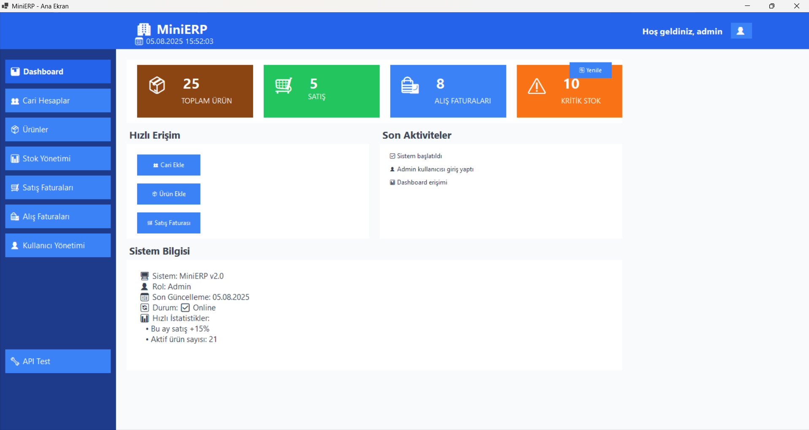
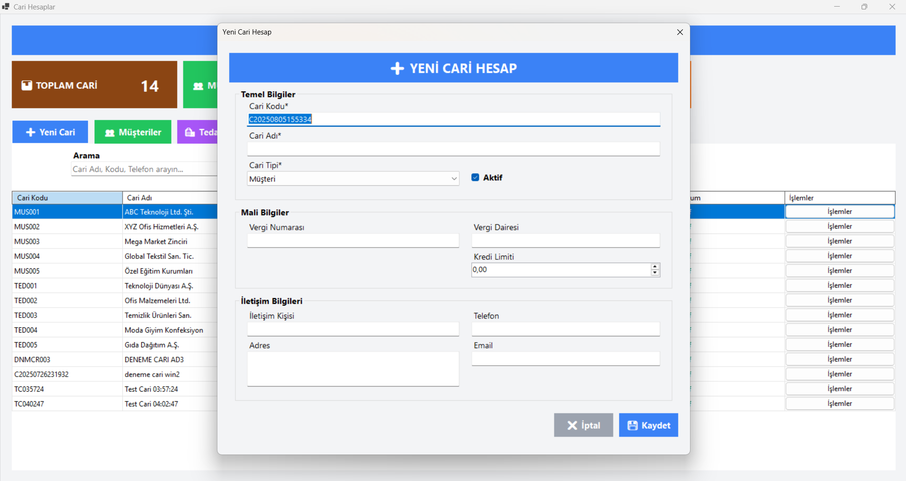

# MiniERP - Küçük İşletmeler İçin ERP Sistemi

Bu proje, küçük ve orta ölçekli işletmeler için geliştirilmiş kapsamlı bir ERP (Enterprise Resource Planning) sistemidir. Ana amacımız, .NET teknolojileri kullanarak **Web API**, **Web Uygulaması** ve **Windows Forms** uygulamaları geliştirmek ve bu uygulamaların birbiriyle tam senkronizasyon halinde çalışmasını sağlamaktır. 

**Proje Hedefi:** Küçük işletmelerin günlük operasyonlarını (stok, satış, alış, cari hesap) kolayca yönetebilmesi için pratik ve kullanışlı bir sistem sunmak. Sistem farklı platformlarda çalışan 3 ana uygulama içerir:

1. **MiniERP.API** - .NET 8 Web API (Backend)
2. **MiniERP.Web** - ASP.NET Core MVC Web Uygulaması
3. **MiniERP.WinForms** - Windows Forms Masaüstü Uygulaması

## Proje Genel Görünümü


MiniERP sistemi, küçük işletmelerin ihtiyaçlarını karşılamak üzere tasarlanmış aşağıdaki ana modülleri içerir:
- **Cari Hesap Yönetimi** (Müşteri/Tedarikçi takibi ve bakiye kontrolü)
- **Stok Yönetimi** (Ürün ve stok takibi, otomatik stok güncelleme)
- **Satış Yönetimi** (Satış faturaları ve otomatik senkronizasyon)
- **Alış Yönetimi** (Alış faturaları ve otomatik senkronizasyon)
- **Raporlama** (İş süreçlerini takip eden çeşitli raporlar)
- **Rol Bazlı Yetkilendirme** (Admin, Manager, Sales, Purchase, Finance, Warehouse, Employee)

**Senkronizasyon Özelliği:** Tüm işlemler (fatura onaylama, stok güncelleme, cari bakiye hesaplama) otomatik olarak gerçekleşir ve masaüstü ile web uygulaması arasında tam senkronizasyon sağlanır.

## Uygulama Bileşenleri

### 🖥️ Windows Forms Uygulaması (MiniERP.WinForms)

Windows Forms uygulaması, masaüstü kullanıcıları için geliştirilmiş modern bir arayüze sahiptir.

#### Özellikler:
- **Modern UI Tasarım** - Web uygulamasına benzer görsel tasarım
- **Rol Bazlı Giriş** - 7 farklı rol için hızlı test girişi
- **API Entegrasyonu** - Backend API ile tam entegrasyon
- **Güvenli Authentication** - JWT token bazlı kimlik doğrulama

#### Test Kullanıcıları:
- **admin** - Tüm sistem yetkilerine sahip
- **manager** - Yönetici yetkileri
- **sales** - Satış işlemleri
- **purchase** - Satın alma işlemleri
- **finance** - Mali işlemler
- **warehouse** - Depo operasyonları
- **employee** - Temel çalışan yetkileri

*Tüm test kullanıcıları için şifre kullanıcı adı ile aynıdır.*

#### Nasıl Çalıştırılır:
```bash
# 1. API'yi başlatın
dotnet run --project MiniERP.API

# 2. Windows Forms uygulamasını çalıştırın
dotnet run --project MiniERP.WinForms
```

### 🌐 Web Uygulaması (MiniERP.Web)

ASP.NET Core MVC ile geliştirilmiş responsive web uygulaması.

### 🔧 API (MiniERP.API)

.NET 8 Web API backend servisi

## Projenin 4 Aşaması

### 1. AŞAMA: SQL VERİTABANI

İlk aşamada SQL Server veritabanı oluşturulmuştur. Bu aşama projenin temelini oluşturur.


#### Veritabanı Yapısı:
- **19 ana tablo** (Users, Products, CariAccounts, SalesInvoices vs.)
- **Otomatik trigger'lar** (Stok ve cari güncellemeleri için)
- **Varsayılan veriler** (Roller, birimler, ödeme türleri)
- **İndeksler** (Performans için)

#### Önemli Tablolar:
```sql
-- Örnek: CariAccounts tablosu
CREATE TABLE CariAccounts (
    Id INT PRIMARY KEY IDENTITY(1,1),
    Code NVARCHAR(50) NOT NULL,
    Name NVARCHAR(200) NOT NULL,
    Balance DECIMAL(18,2) DEFAULT 0,
    CreditLimit DECIMAL(18,2) DEFAULT 0,
    CariTypeId INT FOREIGN KEY REFERENCES CariTypes(Id)
);
```

#### Otomatik İşlemler:
Veritabanında önemli trigger'lar vardır. Örneğin satış faturası onaylandığında:
1. Stok otomatik azalır
2. Cari hesapta alacak kaydı oluşur
3. Stok hareket kaydı oluşur

#### Kurulum:
```sql
-- 1. Database klasöründeki dosyaları sırayla çalıştır:
-- MiniERP_Clean.sql (Ana veritabanı)
-- Test_Data_Insert.sql (Örnek veriler)
```

### 2. AŞAMA: API (Web API)

İkinci aşamada RESTful Web API geliştirilmiştir. Bu API, veritabanı ile diğer aşamalar arasında köprü görevi görür.


#### Teknoloji Yığını:
- **.NET 8.0** (Modern framework)
- **Entity Framework Core** (ORM)
- **JWT Authentication** (Güvenlik)
- **AutoMapper** (Nesne dönüştürme)
- **Serilog** (Loglama)
- **Swagger/OpenAPI** (API dokümantasyon)

#### Ana Controller'lar:
```csharp
// Örnek: CariAccountsController
[ApiController]
[Route("api/[controller]")]
[Authorize]
public class CariAccountsController : ControllerBase
{
    private readonly ICariAccountService _cariAccountService;
    
    [HttpGet]
    public async Task<IActionResult> GetAll()
    {
        var accounts = await _cariAccountService.GetAllAsync();
        return Ok(accounts);
    }
    
    [HttpPost]
    public async Task<IActionResult> Create(CariAccountDto dto)
    {
        var result = await _cariAccountService.CreateAsync(dto);
        return CreatedAtAction(nameof(GetById), new { id = result.Id }, result);
    }
}
```

#### Yapılan İşlemler:
- **Repository Pattern** (Veri erişimi)
- **Service Layer** (İş mantığı)
- **DTO'lar** (Veri transfer nesneleri)
- **JWT ile güvenlik**
- **CORS desteği**

#### API Çalıştırma:
```bash
cd MiniERP.API
dotnet run
# API şu adreste çalışır: http://localhost:5000
```

### 3. AŞAMA: WINDOWS FORMS UYGULAMASI

Üçüncü aşamada masaüstü uygulaması geliştirilmiştir. Bu uygulama API'yi kullanarak çalışır.



#### Özellikler:
- **15+ farklı form** (Cari, Stok, Satış, Alış vs.)
- **API entegrasyonu** (HttpClient ile)
- **Kullanıcı dostu arayüz**
- **Grid'lerle veri listeleme**
- **Detaylı formlar**

#### Ana Formlar:
```csharp
// Örnek: MainForm - Ana menü
public partial class MainForm : Form
{
    private readonly ApiService _apiService;
    private readonly UserDto _loggedInUser;
    
    public MainForm(ApiService apiService, UserDto loggedInUser)
    {
        InitializeComponent();
        _apiService = apiService;
        _loggedInUser = loggedInUser;
    }
    
    private void btnCariAccounts_Click(object sender, EventArgs e)
    {
        var form = new CariAccountListForm(_apiService);
        form.Show();
    }
}
```

#### Yapılan İşlemler:
- **Login sistemi** (JWT ile)
- **CRUD operasyonları** (Ekleme, silme, güncelleme)
- **Listeleme ve filtreleme**
- **Raporlama**
- **Hata yönetimi**


#### Çalıştırma:
```bash
cd MiniERP.WinForms
dotnet run
# Kullanıcı: admin / Şifre: 123456
```

### 4. AŞAMA: WEB UYGULAMASI

Dördüncü aşamada web uygulaması geliştirilmiştir. Bu uygulama da API'yi kullanarak çalışır.


#### Teknoloji Yığını:
- **.NET 9.0 MVC** (Web framework)
- **Bootstrap** (UI framework)
- **jQuery** (JavaScript)
- **Cookie Authentication** (Oturum yönetimi)
- **HttpClient** (API iletişimi)

#### Ana Controller'lar:
```csharp
// Örnek: CariAccountController
public class CariAccountController : Controller
{
    private readonly CariAccountService _cariAccountService;
    
    public CariAccountController(CariAccountService cariAccountService)
    {
        _cariAccountService = cariAccountService;
    }
    
    public async Task<IActionResult> Index()
    {
        var accounts = await _cariAccountService.GetAllAsync();
        return View(accounts);
    }
    
    [HttpGet]
    public IActionResult Create()
    {
        return View();
    }
    
    [HttpPost]
    public async Task<IActionResult> Create(CariAccountCreateModel model)
    {
        if (ModelState.IsValid)
        {
            await _cariAccountService.CreateAsync(model);
            return RedirectToAction(nameof(Index));
        }
        return View(model);
    }
}
```

#### Yapılan Sayfalar:
- **Dashboard** (Ana sayfa)
- **Cari Hesap Yönetimi**
- **Stok Yönetimi**
- **Satış Faturaları**
- **Alış Faturaları**
- **Raporlar**


#### Çalıştırma:
```bash
cd MiniERP.Web
dotnet run
# Web sitesi: http://localhost:5001
# Kullanıcı: admin / Şifre: 123456
```

## Genel Sistem Mimarisi


Sistem şu şekilde çalışır:
1. **Veritabanı** (SQL Server) - Verilerin saklandığı yer
2. **API** (Web API) - Veritabanı ile iletişim kurar
3. **WinForms** - API'yi kullanarak masaüstü arayüzü sağlar
4. **Web** - API'yi kullanarak web arayüzü sağlar

## Kurulum ve Çalıştırma

### Gereksinimler:
- **.NET 8.0 SDK** (API için)
- **.NET 9.0 SDK** (Web ve WinForms için)
- **SQL Server** (LocalDB veya Full)
- **Visual Studio** (İsteğe bağlı)

### Adım Adım Kurulum:

#### 1. Proje İndirme:
```bash
git clone [repository-url]
cd MiniERP
```

#### 2. Veritabanı Kurulum:
```sql
-- SQL Server Management Studio'da:
-- Database/MiniERP_Clean.sql dosyasını çalıştır
-- Database/Test_Data_Insert.sql dosyasını çalıştır
-- Database/Fix_User_Role.sql dosyasını çalıştır
```

#### 3. API Ayarları:
```json
// MiniERP.API/appsettings.json
{
  "ConnectionStrings": {
    "DefaultConnection": "Server=.;Database=MiniERP_Database;Trusted_Connection=true;TrustServerCertificate=true;"
  },
  "JwtSettings": {
    "Secret": "Bu_Gizli_Anahtar_En_Az_32_Karakter_Olmali_Yoksa_Hata_Verir",
    "Issuer": "MiniERP.API",
    "Audience": "MiniERP.Client"
  }
}
```

#### 4. Çalıştırma Sırası:
```bash
# 1. API'yi çalıştır
cd MiniERP.API
dotnet run

# 2. Yeni terminalde WinForms'u çalıştır
cd MiniERP.WinForms
dotnet run

# 3. Yeni terminalde Web'i çalıştır
cd MiniERP.Web
dotnet run
```

## Kullanım Kılavuzu

### Varsayılan Kullanıcı:
- **Kullanıcı Adı:** admin
- **Şifre:** 123456
- **Rol:** Administrator

### Temel İşlemler:

#### 1. Cari Hesap Ekleme:


1. Cari Hesaplar menüsüne gir
2. "Yeni Ekle" butonuna tıkla
3. Bilgileri doldur (Kod, Ad, Tip)
4. Kaydet

#### 2. Ürün Ekleme:


1. Ürünler menüsüne gir
2. "Yeni Ekle" butonuna tıkla
3. Bilgileri doldur (Kod, Ad, Fiyat)
4. Kaydet

#### 3. Satış Faturası Oluşturma:


1. Satış Faturaları menüsüne gir
2. "Yeni Fatura" butonuna tıkla
3. Müşteri seç
4. Ürünleri ekle
5. Faturayı onayla

## Önemli Özellikler

### 1. Otomatik İşlemler:
- **Stok Güncelleme:** Fatura onaylandığında stok otomatik güncellenir
- **Cari Güncelleme:** Fatura onaylandığında cari bakiye güncellenir
- **Hareket Kayıtları:** Tüm işlemler otomatik kayıt altına alınır

### 2. Güvenlik:
- **JWT Authentication:** API güvenliği
- **Role-based Access:** Rol tabanlı erişim kontrolü
- **HTTPS:** Güvenli iletişim

### 3. Performans:
- **Entity Framework Core:** Hızlı veri erişimi
- **Indexing:** Veritabanı performansı
- **Caching:** Bellek içi önbellekleme

## Teknik Detaylar

### Veritabanı Şeması:
```sql
-- Ana tablolar arası ilişki
CariAccounts (1) --> (N) CariTransactions
Products (1) --> (N) StockCards
SalesInvoices (1) --> (N) SalesInvoiceDetails
PurchaseInvoices (1) --> (N) PurchaseInvoiceDetails
```

### API Endpoints:
```
GET    /api/cariaccounts          - Tüm cari hesapları getir
POST   /api/cariaccounts          - Yeni cari hesap oluştur
GET    /api/cariaccounts/{id}     - Belirli cari hesap getir
PUT    /api/cariaccounts/{id}     - Cari hesap güncelle
DELETE /api/cariaccounts/{id}     - Cari hesap sil

GET    /api/products              - Tüm ürünleri getir
POST   /api/products              - Yeni ürün oluştur
GET    /api/products/{id}         - Belirli ürün getir
PUT    /api/products/{id}         - Ürün güncelle
DELETE /api/products/{id}         - Ürün sil
```

### Proje Yapısı:
```
MiniERP/
├── Database/                    # SQL dosyaları
│   ├── MiniERP_Clean.sql
│   ├── Test_Data_Insert.sql
│   └── Fix_User_Role.sql
├── MiniERP.API/                # Web API
│   ├── Controllers/            # API Controllers
│   ├── Services/               # İş mantığı
│   ├── Repositories/           # Veri erişimi
│   ├── Models/                 # Entity sınıfları
│   └── DTOs/                   # Data Transfer Objects
├── MiniERP.WinForms/          # Windows Forms App
│   ├── Forms/                  # Form sınıfları
│   ├── Services/               # API iletişimi
│   └── Models/                 # Model sınıfları
└── MiniERP.Web/               # Web Application
    ├── Controllers/            # MVC Controllers
    ├── Views/                  # Razor Views
    ├── Services/               # API iletişimi
    └── Models/                 # View Models
```

## Sorun Giderme

### Yaygın Sorunlar:

#### 1. API Bağlantı Hatası:
```
Hata: "API'ye bağlanılamıyor"
Çözüm: 
- API'nin çalıştığından emin ol (http://localhost:5000)
- Firewall ayarlarını kontrol et
- appsettings.json'daki bağlantı stringini kontrol et
```

#### 2. Veritabanı Bağlantı Hatası:
```
Hata: "SQL Server'a bağlanılamıyor"
Çözüm:
- SQL Server'ın çalıştığından emin ol
- Connection string'i kontrol et
- Database'in oluşturulduğundan emin ol
```

#### 3. JWT Token Hatası:
```
Hata: "401 Unauthorized"
Çözüm:
- Tekrar giriş yap
- JWT secret key'ini kontrol et
- Token süresini kontrol et
```

#### 4. Winform form Hatası:
```
Hata: Satış ve satın alma formlarında yeni kayıt hatası

ilerleyen süreçte bu sorun düzeltilecektir.

```

#### 5. Rol Bazlı Yetkilendirme Eksikliği:
```
Hata: Role uygun ekranlar ve yetkilendirilmeler yapılamamaktadır

ilerleyen süreçte bu sorun düzeltilecektir.

```


### Debug Modunda Çalıştırma:
```bash
# API'yi debug modunda çalıştır
cd MiniERP.API
dotnet run --environment Development

# WinForms'u debug modunda çalıştır
cd MiniERP.WinForms
dotnet run --configuration Debug
```

## Geliştirici Notları

### Yeni Özellik Ekleme:
1. **Model oluştur** (Database/Models)
2. **Repository oluştur** (API/Repositories)
3. **Service oluştur** (API/Services)
4. **Controller oluştur** (API/Controllers)
5. **Form/View oluştur** (WinForms/Web)

### Kod Örnekleri:
```csharp
// Yeni bir entity için repository örneği
public class ExampleRepository : GenericRepository<Example>, IExampleRepository
{
    public ExampleRepository(AppDbContext context) : base(context) { }
    
    public async Task<List<Example>> GetActiveExamplesAsync()
    {
        return await _context.Examples
            .Where(x => x.IsActive)
            .ToListAsync();
    }
}
```

Bu proje eğitim amaçlı geliştirilmiştir. 

---

Bu README dosyası projenin tüm aşamalarını ve özelliklerini detaylı bir şekilde açıklamaktadır. Herhangi bir sorunuz olursa lütfen iletişime geçmekten çekinmeyin.

## Fotoğraf Listesi

README'de kullanılacak fotoğraflar (images/ klasörüne koyulacak):

1. **proje-genel-gorunum.png** - Projenin genel mimarisi
2. **database-diagram.png** - Veritabanı şeması
3. **api-swagger.png** - Swagger API dokümantasyonu
4. **winforms-main.png** - WinForms ana ekranı
5. **winforms-cari-list.png** - WinForms cari hesap listesi
6. **web-dashboard.png** - Web uygulaması dashboard
7. **web-cari-create.png** - Web'de cari hesap oluşturma
8. **system-architecture.png** - Sistem mimarisi diyagramı
9. **cari-hesap-ekleme.png** - Cari hesap ekleme ekranı
10. **urun-ekleme.png** - Ürün ekleme ekranı
11. **satis-faturasi.png** - Satış faturası oluşturma
